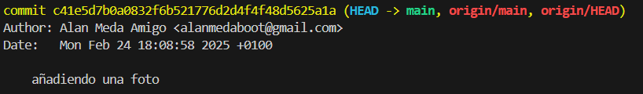
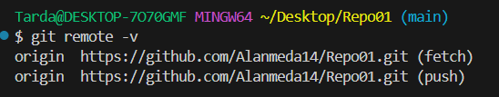

📌`Ex1.1`

- Para poder saber si el repositorio esta inicializado solo tenemos que hacer git status-
#### Git Status
Ahora mismo nos esta indicando en la rama en la que estamos, que esa rama esta conectada al origin/main y que no hay cambios para hacer commits.

📌`Ex1.2`
- Esta actividad ya esta hecha en el momento que estoy escribiendo aqui ya que si no no podria hacerlo jajaj.

📌`Ex1.3`
- En este caso se encuentra en **Staged** quiere decir que esta listo para commitear.
#### Git Commit
Guarda como si fuera una captura de pantalla en el momento actual que lo haces en el repositorio local dejandolo listo para hacer un git push.

#### Git Log 
- Git log nos dice el nombre junto al email del autor
Tambien indica la fecha y hora en la que se hizo el comit.
- Por ultimo nos pone el mensaje que pusimos en el comit en mi caso puse "El primer commit" 

📌`Ex1.4`
- Pues en este caso quiere decir que anteriro mente realizaste un git commit guandando la captura en tu repositorio local, ahora la hacer el git push se te sube al repositorio remoto.
#### Git Push 
Git Push lo que hace es subir al repositorio externo todo lo que hayas guardado con en git commit en tu repositorio local, la primera vez que lo haces tiene que hacerlo con un git push origin main para poder crer la rama en tu repositorio remoto como en este caso hacemos en Github.

📌`Ex1.5`
#### Git Remote -V
El git remore -v nos muestra dos operaciones:
- La Url para descargar los datos 
- La Url para subir los datos 

📌`Ex1.6`

- Ya esta creado 
  
📌`Ex1.7`

- Ya lo tenia creado de antes y lo que sale al hacerlo es lo que puse en la imagen anterirmente 

📌`Ex1.8`

- Lo acabo de subir.

📌`Ex1.9`

- No observo nada raro la verdad.

📌`Ex2.1`

