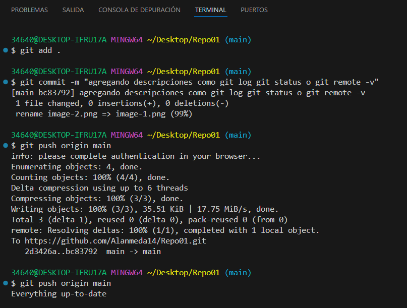

## Git Status 

Git status 

## Git Log 
- Git log nos dice el nombre junto al email del autor
Tambien indica la fecha y hora en la que se hizo el comit.
- Por ultimo nos pone el mensaje que pusimos en el comit en mi caso puse "El primer commit" 

## Git Remote -V

El git remore -v nos muestra dos operaciones:

- La Url para descargar los datos 
- La Url para subir los datos 

